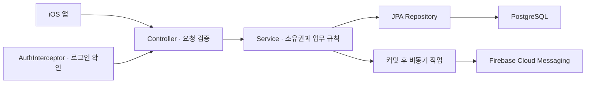

# 북메이트 서버 · BookMate API

**App Store에 출시한 북메이트의 회원 인증·독서 기록·공개 책장·알림을 처리하는 REST API.**

책에서 찾은 단어와 문장을 책 단위로 저장하는 앱의 백엔드. 개인 기록은 작성자에게만 제공하고, 공개 책장과 리뷰는 공개·차단·신고 상태에 따라 구분.

[iOS 앱 코드](https://github.com/cozyrim/bookmate-ios-public) · [개발 환경 설정](docs/setup.md) · [인증과 운영 보안 기준](docs/auth-and-access.md)

## 주요 기능

| 영역 | 구현 |
| --- | --- |
| 회원 | 이메일·카카오·Apple 로그인, 프로필 관리, 회원 탈퇴 |
| 인증 | JWT access token, 해시로 보관하는 refresh token, 갱신 시 토큰 교체 |
| 독서 기록 | 책·단어·문장·메모·리뷰 저장, 책별 기록 조회 |
| 공개 공간 | 공개 사용자 검색·책장·리뷰·방명록, 신고·차단 |
| 알림 | FCM 기기 토큰 등록, 방명록 푸시, 알림함과 읽음 처리 |
| 이미지 | 프로필 이미지 검사 후 로컬 볼륨 또는 Cloudflare R2 저장 |

## 문제를 해결한 과정

### 토큰 갱신 요청이 겹칠 때 같은 자격 증명이 재사용되는 문제

- **판단**: 로그인 상태를 유지하되 refresh token 원문을 DB에 남기지 않고, 갱신에 성공한 토큰은 다시 사용하지 않도록 처리할 필요.
- **해결 과정**: `SecureRandom`으로 토큰 생성, SHA-256 해시와 만료 시각만 저장. 조회 시 DB 행 잠금 후 새 토큰으로 교체.
- **결과 및 배운 점**: 갱신에 성공한 토큰을 교체하고 원문 저장 제거. 클라이언트의 중복 요청 조율과 서버의 토큰 재사용 방지는 각각 필요. 사용자별 단일 토큰 정책과 실제 DB 동시성 검증 범위는 상세 문서에 정리.

[갱신 순서와 세션 정책](docs/refresh-tokens.md)

### 방명록 저장 응답이 외부 알림 발송까지 기다리는 문제

- **판단**: 글 저장 성공과 푸시 전달 성공을 구분. 저장이 취소된 글에 알림이 나가거나 FCM 지연 때문에 저장 응답이 늦어지는 상황을 줄일 필요.
- **해결 과정**: 저장 트랜잭션 커밋 후 별도 Bean의 `@Async` 메서드로 알림 발송 요청.
- **결과 및 배운 점**: iOS 변경과 함께 적용한 당시 실기기 22회 측정에서 API 구간 p95 1,280ms → 235.52ms, **81.6% 감소**. 저장 확정 시점과 알림 전달 보장은 별도로 설계할 필요. 서버 단독 측정값은 아님.

[트랜잭션과 비동기 알림의 경계](docs/guestbook-notifications.md)

### 화면에서 숨기는 것만으로 개인 기록을 보호할 수 없는 문제

- **판단**: 요청에 포함된 책·메모 ID만 믿지 않고 서버가 확인한 사용자 ID로 소유권을 검사할 필요.
- **해결 과정**: 개인 기록 조회·수정·삭제에 사용자 조건 적용. 메모 생성도 소유한 책인지 확인한 뒤 저장. 공개 책장에서는 공개 여부와 차단·신고 조건 확인.
- **결과 및 배운 점**: 다른 사용자의 책에 메모를 작성하는 요청을 거부하는 테스트 추가. 유효한 토큰만으로 개별 기록의 권한이 보장되지 않으므로 소유권 검사를 별도로 검증.

[접근 권한과 테스트 범위](docs/auth-and-access.md)

## 구조와 기술



| 기술 | 사용 목적 |
| --- | --- |
| Java 21 · Spring Boot 4 | REST API와 애플리케이션 설정 |
| Spring Data JPA · PostgreSQL | 데이터 저장, 트랜잭션, refresh token 행 잠금 |
| BCrypt · HMAC-SHA256 | 비밀번호 해시, access token 서명 검증 |
| Firebase Admin SDK | 서버에서 FCM 알림 발송 |
| AWS SDK for Java | S3 호환 Cloudflare R2 이미지 저장 |
| JUnit 5 · Mockito · H2 | 서비스·인증·업로드 검증, 애플리케이션 기동 테스트 |
| Docker Compose · GitHub Actions | 컨테이너 구성과 테스트 자동화 |

도메인별 패키지에 Controller·Service·Repository 배치. 인증은 `auth`, 외부 알림은 `notification`, 신고·차단은 `moderation`에서 관리.

## 실행과 검증

```sh
./gradlew --no-daemon test
```

테스트는 H2와 테스트 전용 서명키 사용. 외부 카카오 요청은 모의 응답으로 검증하며 운영 DB·실제 푸시 발송에 연결하지 않음.

검증 대상은 토큰 생성·만료·변조, refresh token 교체, 소셜 로그인 정보, 메모 소유권, 이미지 형식·크기. 실제 PostgreSQL 동시 요청, 운영 프록시 제한, 실기기 로그인·알림은 별도 통합 검증 대상.

공개용 저장소는 코드·테스트·설정 예시를 제공. 실제 비밀값, 운영 로그, DB 이전 스크립트와 운영 배포용 워크플로는 비공개 개발 저장소에서 관리.
