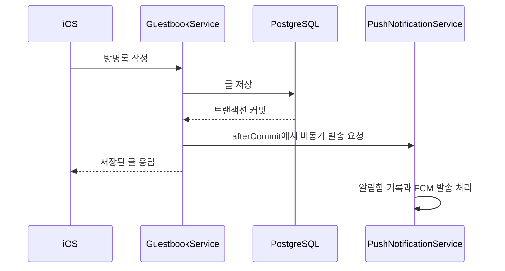

# 방명록 저장과 알림 발송 분리

## 문제와 판단

방명록 저장 요청 안에서 외부 FCM 발송까지 기다리면, 알림 서비스 지연이 글 저장 응답에 영향을 줌. 저장이 최종 확정되기 전에 알림을 발송하면 취소된 글의 알림이 전달될 가능성도 있음.

저장 성공을 먼저 확정하고 그 이후 알림을 요청하는 방식 선택.

## 처리 흐름

- `TransactionSynchronization.afterCommit()`에서 발송 요청.
- 다른 Bean의 `@Async` 메서드를 호출해 Spring 비동기 프록시 적용.
- 엔티티 전체 대신 사용자·메시지 ID와 필요한 작성자 정보를 전달.
- iOS는 임시 글을 먼저 표시하고 서버 응답으로 교체해 화면 반응도 별도로 처리.

## 확인 범위

커밋 이후 비동기 메서드를 호출하는 구조는 코드로 확인. 실제 응답 시간의 전후 측정 자료는 없어 성능 개선 수치는 제시하지 않음.

현재는 애플리케이션 내부 비동기 실행. 프로세스 종료 시 전달 보장, 영속 재시도, FCM 중복 발송 방지를 모두 해결하는 구조는 아님. 작업 큐나 outbox 도입은 알림 전달 보장이 필요한 수준에 따라 판단할 후속 과제.

관련 코드: [GuestbookService](../src/main/java/com/exercise/bookmateserver/social/guestbook/GuestbookService.java), [PushNotificationService](../src/main/java/com/exercise/bookmateserver/notification/PushNotificationService.java).

[README](../README.md)
